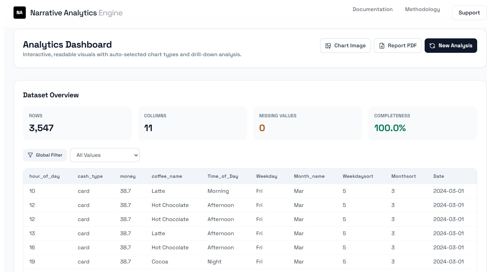
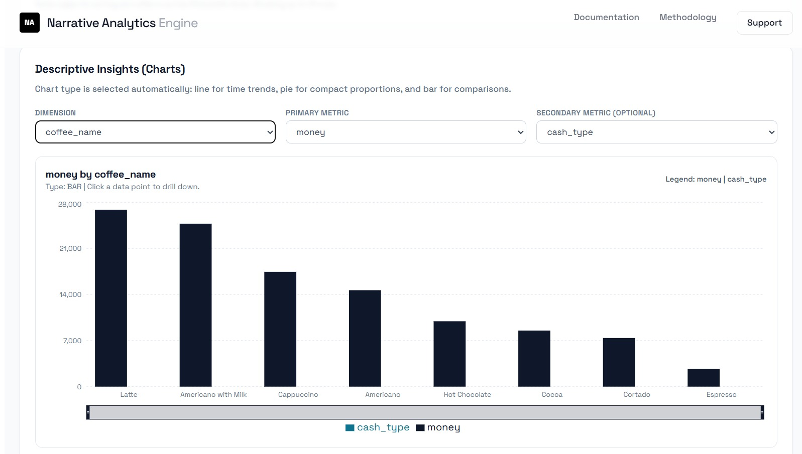
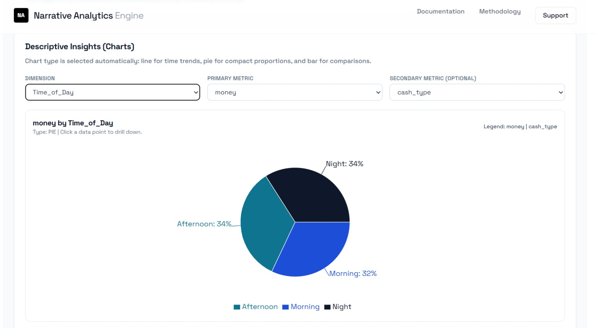

**🚀 Narrative Analytics Engine**

**📌 Overview**

The Narrative Analytics Engine is a web-based analytics platform that transforms structured datasets into clear insights, visualizations, and human-readable explanations.

Unlike traditional dashboards that rely only on charts, this system provides understandable analytics by combining data processing, statistical analysis, and narrative generation. It helps both technical and non-technical users understand data easily.

**The platform focuses on data validation, automated cleaning, insight extraction, visualization, and decision-support analytics.
**
---

## ✨ Key Features

### 🔍 Data Validation & Quality Control
- Detects schema and data types  
- Generates a data quality score  
- Prevents analysis if data is invalid  

---

### 🧹 Data Cleaning & Preprocessing
- Handles missing values and duplicates  
- Normalizes categorical data  
- Detects and treats outliers  
- Maintains processing transparency  

---

### 📊 Analytical Processing
- Exploratory Data Analysis (EDA)  
- Statistical analysis  
- K-Means clustering for segmentation  
- Linear regression for trend prediction  

---

### 📈 Visualization (Current Implementation)
- Visualizations are generated only for descriptive insights  
- Helps understand trends and comparisons clearly  

---

### 📦 Cleaned Dataset Download
- Allows users to download processed dataset  
- Ensures transparency between raw and cleaned data  

---

### 📄 Report Generation
- Generates structured analysis output  
- Can be extended to full report export  

---

## 🧩 System Architecture

User Upload (CSV )  
↓  
Data Validation & Quality Assessment  
↓  
Data Cleaning & Preprocessing  
↓  
EDA & Statistical Analysis  
(K-Means + Linear Regression)  
↓  
Insight Extraction  
↓  
Visualization (Descriptive Only)  
↓  
Output Display + Download  

---

## 🔄 Project Workflow

1. User uploads dataset (CSV / JSON)  
2. System validates dataset structure and quality  
3. Data cleaning and preprocessing are applied  
4. Analytical processing is performed (EDA + ML models)  
5. Insights are extracted  
6. Descriptive insights are visualized  
7. Results are displayed and dataset can be downloaded  

---

 **📌 Current Status**

The system is currently implemented up to the visualization stage.

- Data validation  
- Data cleaning  
- EDA  
- Statistical analysis  
- Insight extraction  
- Descriptive visualization  

---

**🚀 Future Enhancement**

In future versions, the system will provide complete narrative-based insight explanations.

**🔹 Planned Insight Categories**

**Descriptive Insights**  
Explains what happened in the data  
Example: Sales increased steadily over the last quarter  

**Diagnostic Insights**  
Explains why it happened  
Example: Increase is due to higher demand in specific regions  

**Predictive Insights**  
Explains what may happen next  
Example: Sales are expected to grow further if trends continue  

**Prescriptive Insights**  
Suggests what actions should be taken  
Example: Focus on high-performing regions to maximize revenue  

---
**🎯 Enhancement Goals**
- Convert analytics into easy-to-read text explanations  
- Improve understanding for non-technical users  
- Reduce dependency on charts  
- Provide decision-support insights  

---

## 🛠️ Technology Stack

| Layer | Technology | Purpose |
|------|-----------|---------|
| Frontend | React, HTML, CSS | User interface and dashboard design |
| Backend | FastAPI, Python | API handling and server-side logic |
| Data Processing | Pandas, NumPy | Data cleaning, transformation, and analysis |
| Machine Learning / Analytics | Scikit-learn | K-Means clustering and Linear Regression |
| Statistical Analysis | SciPy, Statsmodels | Hypothesis testing and statistical validation |
| Visualization | Plotly / Chart Libraries | Graphs and charts for descriptive insights |
| Data Validation | Pandera / Custom Rules | Data quality checking and validation |
| Export & Reporting | CSV, PDF generation | Download cleaned data and reports |

## 📊 Output

The system generates meaningful analytical results in the form of insights, visualizations, and summaries. Below are the outputs produced by the Narrative Analytics Engine:

---

### 🏠 Dashboard Output

The dashboard provides a complete overview of the system, including processed data, insights, and summary information in a structured format.

---

### 📊 Descriptive Insights Visualization

Descriptive insights are presented using charts and graphs, helping users understand trends, patterns, and data distribution effectively.

---

### 🧠 Insight Output

The system extracts key insights from the dataset and presents them in a structured format, highlighting important findings and analytical results.

---

### 📌 Output Summary

- Displays processed and cleaned data  
- Provides descriptive visualizations  
- Generates meaningful insights  
- Supports decision-making through data interpretation  

---

## ⚙️ Installation

Clone the repository:
git clone https://github.com/MAJJIVIJAYENDRA22/narrative-analytics-enginge.git

Navigate to the project directory:
cd narrative-analytics-engine

Install backend dependencies:
pip install -r requirements.txt

Run backend:
uvicorn main:app --reload

Run frontend:
npm install
npm start

---

## 📜 License

This project is developed for academic and educational purposes.
